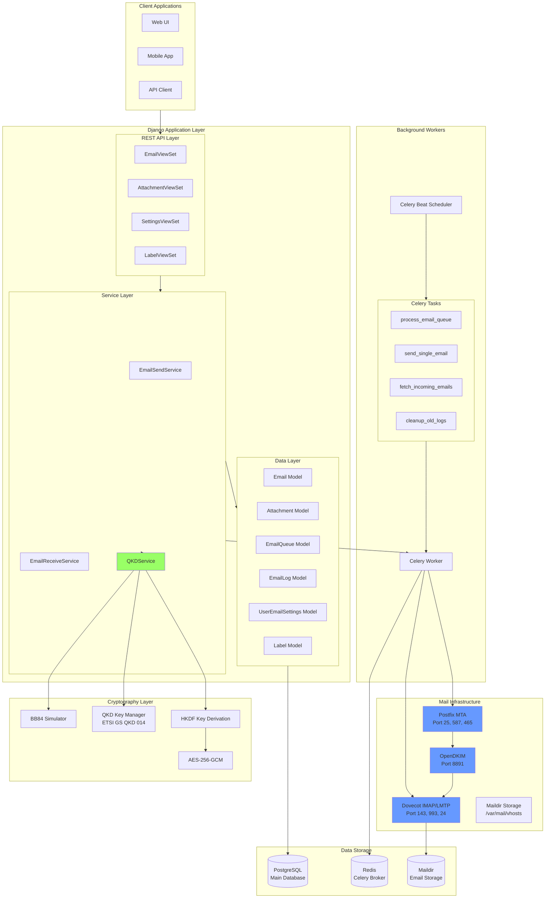
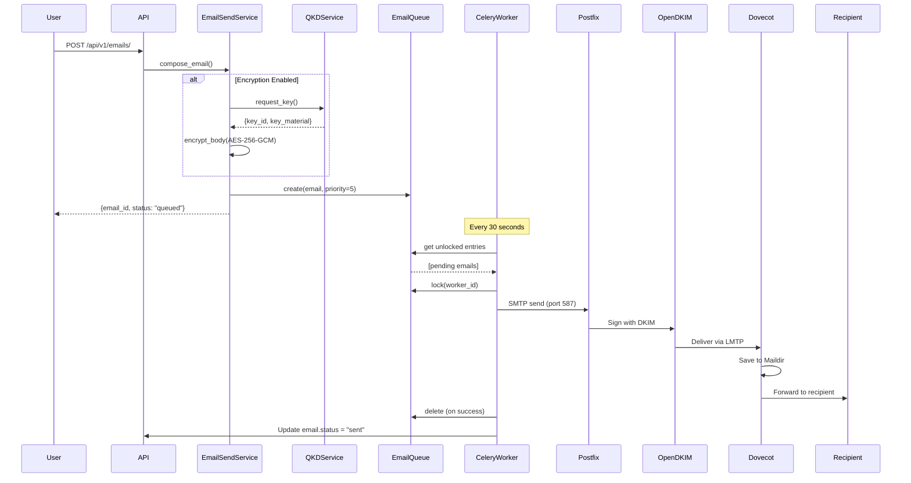
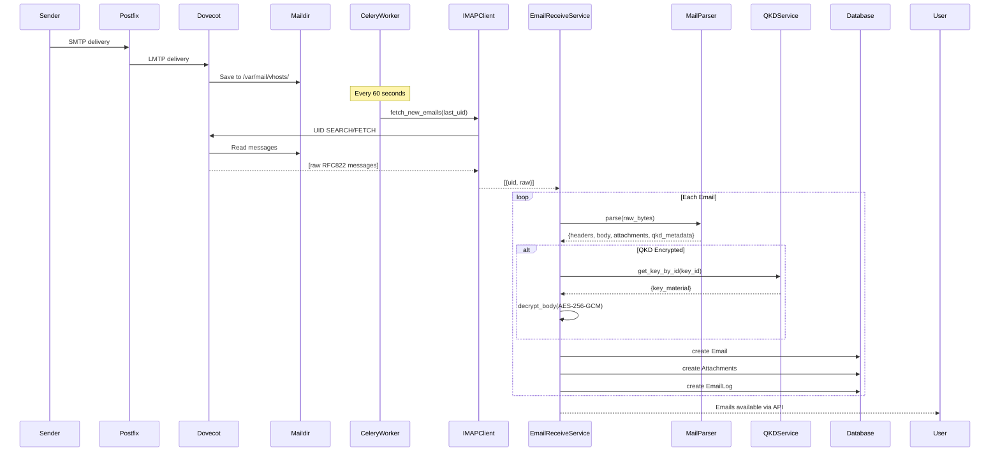
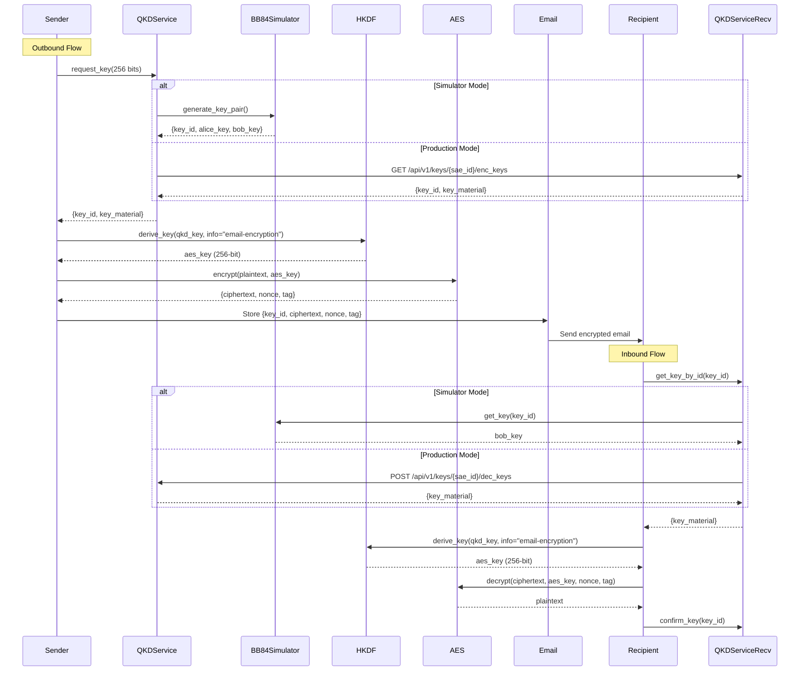
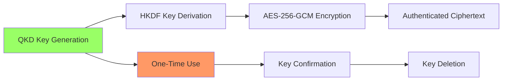

# QtEmail Backend Architecture

## System Overview

QtEmail is a quantum-secured email system that combines traditional email infrastructure (Postfix, Dovecot, OpenDKIM) with Quantum Key Distribution (QKD) for end-to-end encryption.

## Architecture Diagram



## Component Details

### 1. REST API Layer

**Purpose**: Provides RESTful endpoints for email management

**Components**:
- **EmailViewSet**: CRUD operations, reply, forward, bulk actions
- **AttachmentViewSet**: Upload, download, list attachments
- **SettingsViewSet**: User email settings management
- **LabelViewSet**: Email tagging and organization

**Technology**: Django REST Framework (DRF)

**Endpoints**: `/api/v1/emails/`, `/api/v1/attachments/`, `/api/v1/settings/`, `/api/v1/labels/`

### 2. Service Layer

**Purpose**: Business logic and orchestration

**EmailSendService** (`apps/mail/services.py:28-311`):
- Composes new emails
- Encrypts with QKD (optional)
- Queues for async sending
- Handles attachments
- Sends via SMTP

**EmailReceiveService** (`apps/mail/services.py:314-481`):
- Fetches emails via IMAP
- Parses RFC822 messages
- Decrypts QKD-encrypted emails
- Stores in database
- Manages attachments

**QKDService** (`apps/qkd/services.py:10-117`):
- Requests quantum keys
- Retrieves keys by ID
- Confirms key usage
- Switches between simulator and production KM

### 3. Background Workers

**Celery Tasks** (`apps/mail/tasks.py`):

1. **process_email_queue** (every 30s)
   - Dequeues pending emails
   - Locks entries to prevent duplicates
   - Delegates to send_single_email

2. **send_single_email**
   - Sends individual email
   - Implements retry logic (max 5 attempts)
   - Exponential backoff on failure
   - Updates email status

3. **fetch_incoming_emails** (every 60s)
   - Polls IMAP for all users
   - Incremental fetch using UID
   - Calls EmailReceiveService

4. **cleanup_old_logs** (daily at 3 AM)
   - Deletes logs older than 90 days
   - Prevents database bloat

5. **cleanup_old_queue_entries** (every 6 hours)
   - Unlocks stale locked entries
   - Handles crashed workers

### 4. Mail Infrastructure

**Postfix** (`config/postfix/`):
- Receives mail on port 25 (SMTP)
- Accepts authenticated submissions on port 587
- Relays through OpenDKIM
- Delivers to Dovecot via LMTP

**OpenDKIM** (`config/opendkim/`):
- Signs all outgoing mail
- Uses RSA-2048 keys
- Selector: `default`
- Domain: `qutemail.local`

**Dovecot** (`config/dovecot/`):
- IMAP server on ports 143 (plain) and 993 (SSL)
- LMTP server on port 24
- Maildir format storage
- SASL authentication for Postfix

### 5. Data Models

**Email** (`apps/mail/models.py:14-207`):
```python
- message_id: Unique RFC822 ID
- folder: inbox/sent/drafts/trash/spam/archive
- subject, from_address, to_addresses, cc_addresses, bcc_addresses
- body_text, body_html
- is_encrypted, qkd_key_id, encryption_nonce, encryption_tag
- is_read, is_starred
- status: draft/queued/sending/sent/failed/received
- size, has_attachments
- Relationships: attachments, labels, logs, queue
```

**Attachment** (`apps/mail/models.py:210-272`):
```python
- filename, content_type, size
- data: BinaryField (stores in PostgreSQL)
- checksum: SHA-256
- content_id, is_inline (for embedded images)
```

**EmailQueue** (`apps/mail/models.py:275-372`):
```python
- email: ForeignKey to Email
- priority: 1-10 (higher = more urgent)
- attempts, max_attempts
- scheduled_at, next_retry_at
- is_locked, locked_by, locked_at
- Methods: lock(), unlock()
```

**EmailLog** (`apps/mail/models.py:375-452`):
```python
- email: ForeignKey to Email
- event_type: queued/sent/failed/encrypted/decrypted/retry
- message, metadata
- error_message, traceback
- created_at
```

**UserEmailSettings** (`apps/mail/models.py:455-537`):
```python
- user: OneToOne to User
- email_address: user@qutemail.local
- display_name
- smtp_password_encrypted, imap_password_encrypted
- enable_qkd_encryption
- auto_fetch_interval
- storage_quota_mb, storage_used_mb
- last_sync_at
- Methods: get_storage_usage_percentage(), update_storage_usage()
```

## Data Flow Diagrams

### Outbound Email Flow



### Inbound Email Flow



### QKD Encryption Flow



## Technology Stack

### Backend Framework
- **Django 5.0.1**: Web framework
- **Django REST Framework 3.14.0**: REST API
- **PostgreSQL 15**: Primary database
- **Redis 7**: Celery broker and cache

### Asynchronous Processing
- **Celery 5.3.4**: Task queue
- **Celery Beat**: Periodic task scheduler

### Mail Infrastructure
- **Postfix**: SMTP MTA
- **Dovecot**: IMAP server and LDA
- **OpenDKIM**: DKIM signing

### Cryptography
- **cryptography 41.0.7**: Python crypto library
- **HKDF**: Key derivation function
- **AES-256-GCM**: Authenticated encryption
- **QKD**: Quantum key distribution

### Email Processing
- **mail-parser 3.15.0**: RFC822 parsing
- **imaplib**: IMAP client
- **smtplib**: SMTP client

### Deployment
- **Docker & Docker Compose**: Containerization
- **Gunicorn 21.2.0**: WSGI HTTP server

## Security Architecture

### Authentication & Authorization
- Django session-based authentication
- User-based permission model
- Each user can only access their own emails

### Encryption Layers

1. **Transport Layer**: TLS/SSL for SMTP/IMAP
2. **Storage Layer**: Encrypted passwords in database
3. **Content Layer**: QKD-based email body encryption
4. **Signing Layer**: DKIM signatures on all outbound mail

### QKD Security Model



**Key Properties**:
- **One-Time Use**: Each key used only once
- **Information-Theoretic Security**: QKD provides unconditional security
- **Forward Secrecy**: Past communications secure even if future keys compromised
- **Authentication**: AES-GCM provides authenticated encryption

### Threat Model

**Protected Against**:
- ✅ Man-in-the-middle attacks (QKD + TLS)
- ✅ Email spoofing (DKIM signatures)
- ✅ Passive eavesdropping (QKD encryption)
- ✅ Brute force attacks (Quantum-secure keys)
- ✅ SQL injection (Django ORM)
- ✅ XSS attacks (DRF serialization)

**Not Protected Against**:
- ❌ Endpoint compromise (if attacker controls sender/receiver device)
- ❌ Social engineering
- ❌ Physical access to servers
- ❌ Quantum computer attacks on RSA (DKIM keys should be rotated)

## Performance Characteristics

### Throughput
- **Queue Processing**: 10 emails per batch, every 30 seconds = ~1,200 emails/hour
- **IMAP Polling**: 60-second intervals, 50 emails per fetch
- **API Requests**: Limited by Django/DRF (typically 100-1000 req/s)

### Latency
- **Email Composition**: <100ms
- **QKD Key Request**: 10-50ms (simulator), 100-500ms (production KM)
- **Encryption**: ~1ms per email
- **Queue → Sent**: 30-90 seconds (queue interval + SMTP delivery)
- **Inbox → API**: 60-120 seconds (IMAP polling interval)

### Scalability
- **Horizontal Scaling**: Add more Celery workers
- **Vertical Scaling**: Increase worker concurrency
- **Database Scaling**: PostgreSQL read replicas
- **Queue Scaling**: Redis Cluster

### Resource Usage
- **Memory**: ~500MB per Celery worker
- **CPU**: Low (I/O bound workload)
- **Disk**: Depends on email volume (avg 50KB/email)
- **Network**: Depends on email size and frequency

## Configuration

### Environment Variables

See `.env.example` for full configuration options.

**Critical Settings**:
```bash
# QKD Mode
QKD_SIMULATOR_MODE=True  # False for production QKD KM

# Mail Server
SMTP_HOST=localhost
SMTP_PORT=587
IMAP_HOST=localhost
IMAP_PORT=993

# Celery Schedules
# Defined in qutemail/settings.py CELERY_BEAT_SCHEDULE
```

### Celery Beat Schedule

```python
CELERY_BEAT_SCHEDULE = {
    'process-email-queue': {
        'task': 'mail.tasks.process_email_queue',
        'schedule': 30.0,  # Every 30 seconds
    },
    'fetch-incoming-emails': {
        'task': 'mail.tasks.fetch_incoming_emails',
        'schedule': 60.0,  # Every 60 seconds
    },
    'cleanup-old-logs': {
        'task': 'mail.tasks.cleanup_old_logs',
        'schedule': crontab(hour=3, minute=0),  # Daily at 3 AM
        'kwargs': {'days': 90},
    },
    'cleanup-stale-queue-entries': {
        'task': 'mail.tasks.cleanup_old_queue_entries',
        'schedule': crontab(hour='*/6', minute=0),  # Every 6 hours
        'kwargs': {'hours': 24},
    },
}
```

## Monitoring & Logging

### Log Locations
- **Django**: Console or configured log file
- **Celery**: Console with `-l info` flag
- **Postfix**: `/var/log/postfix/postfix.log`
- **Dovecot**: `/var/log/dovecot/dovecot.log`
- **OpenDKIM**: Syslog

### Metrics to Monitor
- Queue depth (EmailQueue.count)
- Failed emails (Email.status = 'failed')
- IMAP sync lag (time since last_sync_at)
- Storage usage (UserEmailSettings.storage_used_mb)
- Celery worker health
- Redis connection status
- PostgreSQL query performance

### Health Checks
```bash
# Django
curl http://localhost:8000/api/v1/emails/

# Celery
celery -A qutemail inspect active

# Redis
redis-cli ping

# PostgreSQL
pg_isready -U qutemail_user

# Postfix
postqueue -p

# Dovecot
doveadm who
```

## Backup Strategy

### Database Backups
```bash
# PostgreSQL dump
pg_dump -U qutemail_user qutemail_db > backup.sql

# Restore
psql -U qutemail_user qutemail_db < backup.sql
```

### Maildir Backups
```bash
# Rsync mailboxes
rsync -avz /var/mail/vhosts/ /backup/mailboxes/
```

### Configuration Backups
```bash
# Backup all configs
tar -czf qutemail-config-$(date +%Y%m%d).tar.gz \
  config/ \
  .env \
  docker-compose.yml
```

## Future Enhancements

### Planned Features
- [ ] PGP/GPG integration alongside QKD
- [ ] S/MIME support
- [ ] Email threading and conversation view
- [ ] Full-text search (Elasticsearch)
- [ ] Spam filtering (SpamAssassin)
- [ ] Virus scanning (ClamAV)
- [ ] Webmail interface
- [ ] Mobile push notifications
- [ ] Calendar integration (CalDAV)
- [ ] Contacts sync (CardDAV)

### Performance Optimizations
- [ ] Celery result caching
- [ ] Database query optimization
- [ ] Connection pooling
- [ ] CDN for attachments
- [ ] Message deduplication

### Security Enhancements
- [ ] Rate limiting
- [ ] Two-factor authentication
- [ ] Email encryption at rest
- [ ] Audit logging
- [ ] Security headers (CSP, HSTS)

## References

1. [ETSI GS QKD 014 - Protocol and data format of REST-based key delivery API](https://www.etsi.org/deliver/etsi_gs/QKD/001_099/014/01.01.01_60/gs_QKD014v010101p.pdf)
2. [RFC 5321 - Simple Mail Transfer Protocol](https://tools.ietf.org/html/rfc5321)
3. [RFC 3501 - Internet Message Access Protocol](https://tools.ietf.org/html/rfc3501)
4. [RFC 6376 - DomainKeys Identified Mail (DKIM)](https://tools.ietf.org/html/rfc6376)
5. [RFC 5322 - Internet Message Format](https://tools.ietf.org/html/rfc5322)
