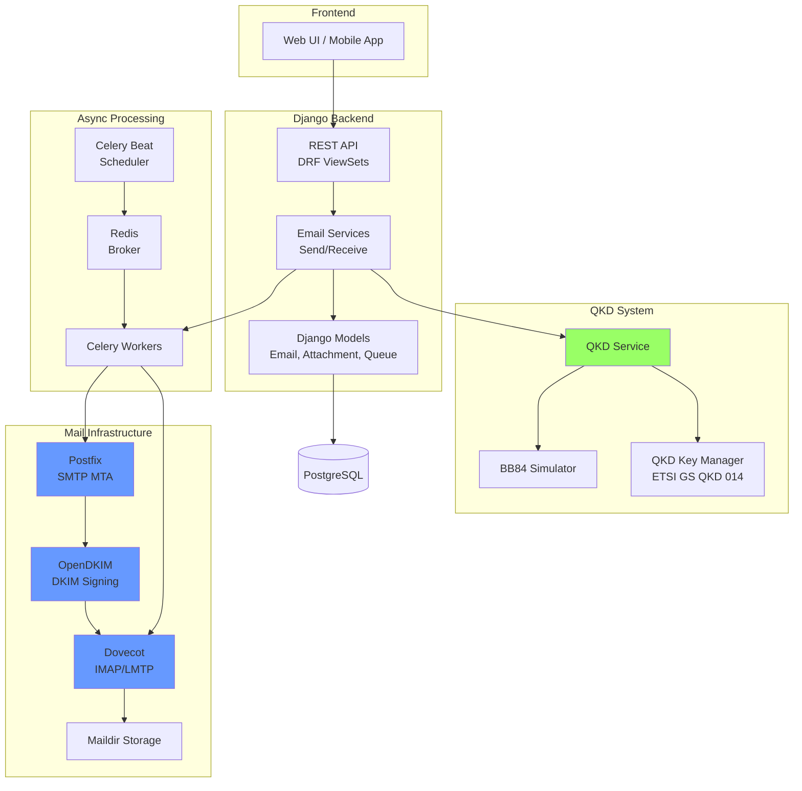

# QtEmail Backend Documentation

**A production-grade quantum-secured email system with self-hosted SMTP infrastructure**

## 📚 Documentation Index

1. [Architecture Overview](./ARCHITECTURE.md) - System design, components, and data flow
2. [API Reference](./API_REFERENCE.md) - Complete REST API documentation
3. [Testing Guide](./TESTING_GUIDE.md) - How to test all functionalities
4. [Deployment Guide](./DEPLOYMENT.md) - Production deployment instructions
5. [Developer Guide](./DEVELOPER_GUIDE.md) - Code reference and development workflow

## 🚀 Quick Start

### Prerequisites

- Python 3.11+
- Docker & Docker Compose
- PostgreSQL 15+ (or use SQLite for development)
- Redis 7+

### Installation

```bash
# Clone repository
git clone <repository-url>
cd qutemail-backend

# Create virtual environment
python -m venv venv
source venv/bin/activate  # On Windows: venv\Scripts\activate

# Install dependencies
pip install -r requirements.txt

# Copy environment file
cp .env.example .env

# Start infrastructure services
docker-compose up -d

# Generate DKIM keys
mkdir -p config/opendkim/keys
cd config/opendkim/keys
docker exec opendkim-genkey -b 2048 -d qutemail.local -s default -v
docker exec chmod 600 default.private
cd ../../..

# Run migrations
python manage.py migrate

# Create superuser
python manage.py createsuperuser


# Start Django development server
python manage.py runserver

# In separate terminals, start Celery
celery -A qutemail worker -l info
celery -A qutemail beat -l info
```

### Quick Test

```python
# Django shell
python manage.py shell

from django.contrib.auth import get_user_model
from mail.models import UserEmailSettings
from mail.services import EmailSendService

User = get_user_model()
user = User.objects.first()

# Create user email settings
settings, _ = UserEmailSettings.objects.get_or_create(
    user=user,
    defaults={
        'email_address': f'{user.username}@qutemail.local',
        'display_name': user.username,
        'enable_qkd_encryption': True,
    }
)

# Send a test email
service = EmailSendService(user)
email = service.compose_email(
    to_addresses=['test@qutemail.local'],
    subject='Test Email',
    body_text='Hello from QtEmail!',
    encrypt=True
)

print(f"Email created: {email.id}")
print(f"Status: {email.status}")
print(f"Encrypted: {email.is_encrypted}")
```

## 🏗️ Architecture Overview



## 🔑 Key Features

### ✅ Quantum Key Distribution (QKD)
- BB84 protocol simulator for development
- ETSI GS QKD 014 standard compliance for production
- Hybrid encryption (HKDF + AES-256-GCM)
- One-time pad support

### ✅ Self-Hosted Email Infrastructure
- **Postfix**: Full-featured SMTP MTA
- **Dovecot**: IMAP server with Maildir storage
- **OpenDKIM**: DKIM signing for all outbound mail
- Docker-based deployment

### ✅ Asynchronous Processing
- Celery-based email queue with retry logic
- IMAP polling every 60 seconds
- Exponential backoff for failed deliveries
- Automatic cleanup of old logs

### ✅ REST API
- Complete CRUD operations
- Email composition with attachments
- Reply/forward functionality
- Bulk actions (mark read, move, delete)
- Label/tag management

### ✅ Security Features
- QKD encryption for email bodies
- DKIM signing on all outbound mail
- TLS/SSL support for SMTP/IMAP
- SASL authentication
- Password encryption in database

## 📊 System Statistics

- **7 Database Models** - Comprehensive email data storage
- **6 Celery Tasks** - Asynchronous email processing
- **4 ViewSets** - RESTful API endpoints
- **11 Serializers** - Request/response validation
- **30+ API Endpoints** - Full email management
- **3,000+ Lines of Code** - Production-ready implementation

## 🔗 Related Documentation

- [ETSI GS QKD 014 Standard](https://www.etsi.org/deliver/etsi_gs/QKD/001_099/014/01.01.01_60/gs_QKD014v010101p.pdf)
- [Postfix Documentation](http://www.postfix.org/documentation.html)
- [Dovecot Documentation](https://doc.dovecot.org/)
- [OpenDKIM Documentation](http://www.opendkim.org/docs.html)
- [Django REST Framework](https://www.django-rest-framework.org/)
- [Celery Documentation](https://docs.celeryproject.org/)

## 📝 License

[Add your license here]

## 👥 Contributors

[Add contributors here]

## 🐛 Bug Reports

Please report bugs at: [Add issue tracker URL]
